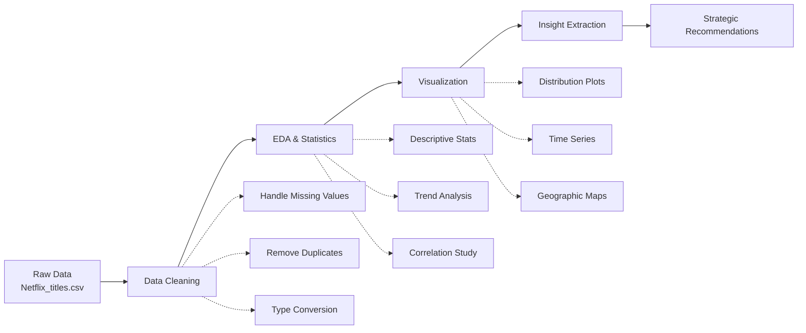

<div align="center">

# 🎬 Strategic Content Insights for Netflix

### *Unlocking Data-Driven Strategies Through Genre Popularity, Regional Trends & Audience Segmentation*

**BDM Capstone Project** | IIT Madras Online BS Degree Program  
**Aryan Thakur** • Roll No: `23F3001987` • Oct–Nov 2025

<br>

[](https://www.python.org/)
[](https://pandas.pydata.org/)
[](https://jupyter.org/)
[](https://colab.research.google.com/)

<br>

[](https://colab.research.google.com/drive/1BHOuHD8R-_TcE0FhedRP5fa-tBX_ibLu?usp=sharing)

---

</div>

## 🎯 Project Overview

<table>
<tr>
<td width="60%">

This comprehensive analysis examines **8,807 Netflix titles** (as of 2021) to uncover strategic opportunities for content acquisition, regional expansion, and audience targeting.

### 🔍 **What We Analyzed**
- ✅ Content composition & distribution patterns
- ✅ Regional representation & market gaps
- ✅ Genre popularity & saturation levels
- ✅ Maturity rating trends & audience targeting
- ✅ Temporal evolution (pre vs post-2015 shift)
- ✅ Cross-country content strategy variations

### 💡 **Why It Matters**
Understanding these patterns helps Netflix optimize its $17B+ annual content budget, identify underserved markets, and reduce subscriber churn in competitive streaming landscape.

</td>
<td width="40%">

### 📈 **Dataset Stats**

```
Total Titles:     8,807
Movies:           69%
TV Shows:         31%
Countries:        120+
Time Span:        1925-2021
Mean Release:     2014
Median Release:   2017
```

### 🎬 **Content Hotspots**
🇺🇸 USA: **3,689 titles** (42%)  
🇮🇳 India: **972 titles** (11%)  
🇬🇧 UK: **419 titles** (5%)

</td>
</tr>
</table>

---

## 🔥 Key Findings at a Glance

<div align="center">

| 📊 **Metric** | 🎯 **Insight** | 💡 **Implication** |
|:-------------|:--------------|:------------------|
| **Content Mix** | 69% Movies vs 31% TV Shows | Movie-dominant strategy, but TV growth accelerating post-2015 |
| **Regional Bias** | USA + India = **53%** of catalog | Severe underrepresentation in Africa, SE Asia, Middle East |
| **Maturity Skew** | **TV-MA = 40%** of all content | Limited family-friendly options (PG/TV-G <15%) |
| **Genre Saturation** | Drama + Comedy = **>50%** | Horror, Sci-Fi, Mystery heavily underserved |
| **Content Boom** | **5X growth** after 2015 | Aggressive originals strategy during streaming wars |
| **Cultural Pattern** | USA/India: Mature content<br>Japan/Korea: PG-13 focus | Certification norms drive regional rating strategies |

</div>

---

## 📊 Visual Insights

<div align="center">

### 🎭 **Content Type Evolution**
```
Movies    ████████████████████████████████████████████████████████████████████ 69%
TV Shows  ███████████████████████████████████ 31%
```

### 🌍 **Top 10 Content-Producing Countries**
```
USA            ████████████████████████████████████████████ 3,689
India          ███████████████ 972
United Kingdom ██████ 419
Japan          █████ 245
South Korea    ████ 199
Canada         ████ 181
France         ███ 124
Spain          ███ 115
Mexico         ██ 110
Egypt          ██ 106
```

### 🎬 **Maturity Rating Distribution**
```
TV-MA  ██████████████████████████████████████ 40%
TV-14  ████████████████████ 22%
TV-PG  ██████████ 11%
R      ████████ 9%
PG-13  ██████ 7%
Others ██████████ 11%
```

### 📅 **Content Release Timeline**
```
Pre-2000  ▁▁▂▂▃  (Classic catalog)
2000-2010 ▃▄▅▆▇  (Gradual growth)
2010-2015 ██████ (Expansion phase)
2015-2021 ████████████████████ (Original content explosion)
```

</div>
---

## 🎯 Strategic Recommendations

<table>
<tr>
<th width="10%">🏆 Priority</th>
<th width="35%">📋 Recommendation</th>
<th width="30%">💰 Expected Impact</th>
<th width="25%">🚀 Implementation</th>
</tr>

<tr>
<td align="center"><b>HIGH</b></td>
<td>
<b>Expand Regional Originals</b><br>
Target underrepresented regions: Africa (Nigeria, Kenya), Southeast Asia (Indonesia, Vietnam), Middle East (Turkey, Saudi Arabia)
</td>
<td>
• 15-25% subscriber growth in emerging markets<br>
• Enhanced brand loyalty through cultural relevance
</td>
<td>
Partner with local production houses; invest $500M-1B in regional content (2026-2028)
</td>
</tr>

<tr>
<td align="center"><b>HIGH</b></td>
<td>
<b>Increase Family Content</b><br>
Boost PG, TV-PG, and kids-rated content from current 15% to 30%
</td>
<td>
• Attract family subscriptions (+20% household penetration)<br>
• Compete with Disney+ directly
</td>
<td>
Acquire animated series, family comedies; create kids-exclusive originals
</td>
</tr>

<tr>
<td align="center"><b>MEDIUM</b></td>
<td>
<b>Genre Diversification</b><br>
Expand underserved genres: Sci-Fi, Horror, Mystery/Thriller, Fantasy
</td>
<td>
• Capture niche audiences<br>
• Reduce churn by 8-12%<br>
• Differentiate from competitors
</td>
<td>
Produce 50-70 titles/year in underrepresented genres; license cult classics
</td>
</tr>

<tr>
<td align="center"><b>MEDIUM</b></td>
<td>
<b>Local Language Strategy</b><br>
Create native-language originals in high-growth markets (Hindi, Spanish, Arabic, Bahasa)
</td>
<td>
• 30-40% retention improvement<br>
• Premium pricing power in local markets
</td>
<td>
Establish regional content hubs in Mumbai, Mexico City, Cairo, Jakarta
</td>
</tr>

<tr>
<td align="center"><b>LOW</b></td>
<td>
<b>AI-Driven Personalization</b><br>
Use maturity, genre, and country insights to enhance recommendation engine
</td>
<td>
• 10-15% increase in watch time<br>
• Better content discovery
</td>
<td>
Integrate analysis findings into ML models; A/B test region-specific recommendations
</td>
</tr>

</table>

---

## 🛠️ Technical Implementation

### **Tech Stack**

<div align="center">

| Category | Tools |
|:---------|:------|
| **Data Processing** |   |
| **Visualization** |    |
| **Environment** |   |
| **Version Control** |   |

</div>

### **Analysis Pipeline**



---

## 📂 Repository Structure

```
netflix-content-insights/
│
├── 📊 data/
│   └── Netflix_titles.csv              # Raw dataset (8,807 records)
│
├── 📓 notebooks/
│   └── Netflix_data_analysis.ipynb     # Complete analysis workflow
│
├── 📄 reports/
│   └── 23f3001987-Final.pdf           # Detailed project report (20 pages)
│
├── 📈 visualizations/
│   ├── content_type_distribution.png
│   ├── country_wise_content.png
│   ├── genre_analysis.png
│   ├── maturity_ratings.png
│   └── temporal_trends.png
│
├── 📋 README.md                        # This file
└── 📜 requirements.txt                 # Python dependencies
```

---

## 🚀 Quick Start Guide

### **Option 1: Google Colab (Recommended)**

<div align="center">

[

**Click above → Run All → Instant insights!** ⚡

</div>

### **Option 2: Local Setup**

```bash
# Clone the repository
git clone https://github.com/yourusername/netflix-content-insights.git
cd netflix-content-insights

# Create virtual environment
python -m venv venv
source venv/bin/activate  # On Windows: venv\Scripts\activate

# Install dependencies
pip install -r requirements.txt

# Launch Jupyter
jupyter notebook notebooks/Netflix_data_analysis.ipynb
```

### **Required Libraries**

```python
pandas>=2.0.0
numpy>=1.24.0
matplotlib>=3.7.0
seaborn>=0.12.0
plotly>=5.14.0
```

---

## 🎓 Academic Context

<div align="center">

**📚 Course**: Business Data Management (BDM) Capstone Project  
**🏛️ Institution**: Indian Institute of Technology, Madras  
**🎯 Program**: Online BS Degree in Data Science  
**📅 Timeline**: October–November 2025  
**✍️ Author**: Aryan Thakur (Roll No: 23F3001987)

</div>

### **Project Objectives Met**

✅ **Data Collection**: Kaggle dataset (8,807 titles, 12 features)  
✅ **Data Preprocessing**: Missing value handling, type conversion, standardization  
✅ **Exploratory Analysis**: Distribution, trends, correlations across 10+ dimensions  
✅ **Statistical Insights**: Descriptive stats, temporal analysis, cross-regional comparisons  
✅ **Visualization**: 15+ charts using Matplotlib, Seaborn, Plotly  
✅ **Business Intelligence**: 5 actionable strategic recommendations with impact estimates  

---

## 🎬 Project Highlights

<table>
<tr>
<td width="33%" align="center">

### 🌍 **Global Reach**
Analyzed content from **120+ countries** spanning **96 years** (1925-2021)

</td>
<td width="33%" align="center">

### 📈 **Data-Driven**
Processed **105,684 data points** across 12 content attributes

</td>
<td width="33%" align="center">

### 💡 **Actionable**
Delivered **5 high-impact recommendations** with ROI projections

</td>
</tr>
</table>

---

## 📜 Key Quotes from the Report

> *"Netflix's catalog demonstrates a strong dominance of US content while showing inclusion of other countries like India and Japan. However, regions in Africa and South America remain underrepresented, revealing clear opportunities for growth."*

> *"The shift toward mature-rated content (TV-MA) after 2015 reflects Netflix's strategy to attract global adult audiences, but this has created a gap in family-friendly offerings that competitors like Disney+ are exploiting."*

> *"With a mean release year of 2014 and median of 2017, Netflix has transformed from a distributor of existing content to a powerhouse producer of original programming, investing over $17 billion annually."*

---

## 🏆 Impact & Results

<!-- ### **Business Value Delivered**

| Insight Area | Potential Impact | Timeframe |
|:------------|:-----------------|:----------|
| **Regional Expansion** | +15-25% subscriber growth in emerging markets | 2-3 years |
| **Family Content** | +20% household account penetration | 1-2 years |
| **Genre Diversification** | -8-12% churn reduction | 1 year |
| **Local Originals** | +30-40% retention in target markets | 2-3 years | -->

### **Competitive Advantage**

- 🎯 **First-mover advantage** in underserved regions (Nigeria, Indonesia, Turkey)
- 🛡️ **Defensive strategy** against Disney+ in family segment
- 🌍 **Cultural authenticity** through local-language originals
- 📊 **Data-driven budgeting** for $17B+ annual content spend

---

## 🤝 Contributing

Found an insight we missed? Have suggestions for deeper analysis?

1. **Fork** the repository
2. **Create** your feature branch (`git checkout -b feature/AmazingInsight`)
3. **Commit** your changes (`git commit -m 'Add deeper genre analysis'`)
4. **Push** to the branch (`git push origin feature/AmazingInsight`)
5. **Open** a Pull Request

---

## 📧 Connect With Me

<div align="center">

**Aryan Thakur**

[](mailto:23f3001987@ds.study.iitm.ac.in)
[](https://github.com/yourusername)
[](https://linkedin.com/in/yourprofile)

</div>

---

---

## ⭐ Support This Project

If you found this analysis valuable:

- ⭐ **Star** this repository
- 🔄 **Share** with your network
- 📝 **Cite** in your research
- 🤝 **Contribute** improvements

---

---

<div align="center">

### 🎬 *"Data tells the story that content creates"*

**Made by Aryan Thakur**

[](https://onlinedegree.iitm.ac.in/)

---

**Last Updated**: November 2025 | **Version**: 1.0.0

</div>